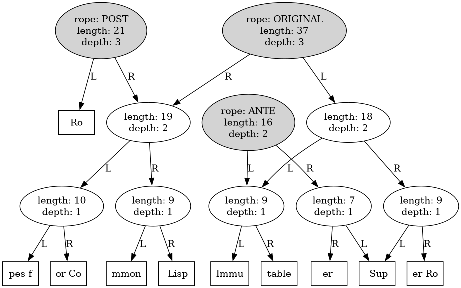
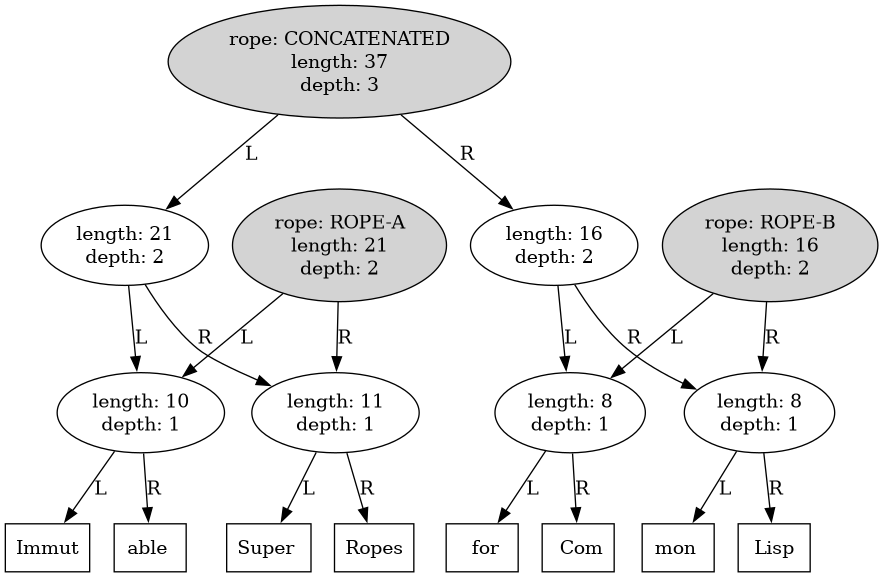

Immutable Ropes for Common Lisp

Have you ever wanted to make yet another Emacs clone?  Well now you
can use ropes to do it so you can tell everyone on Twitter and
Hackernews that your editor is blazingly fast and super serious and
uses fancy text structures.

None of the exported symbols mutate ropes, they return new ones.  This
lets us reuse as many leaves and branches as possible to reduce memory
usage, as well as enable a functional style of programming.

# Installation

With Ultralisp installed:

```lisp
(ql:quickload :rope)
```

# Usage

Convert a string to a rope with `make-rope`, and turn it back into a
string with `write-rope` passing `nil` as the output.

```lisp
(let* ((rope (rope:make-rope "Immutable Ropes for Common Lisp"))
       (super (rope:insert-rope rope 10 "Super "))
       (superer (rope:kill-rope super 0 10)))
  (list
   (rope:write-rope rope nil)
   (rope:write-rope super nil)
   (rope:write-rope superer nil)))
```

Split a rope at an index

```lisp
(let ((rope (rope:make-rope "Immutable Super Ropes for Common Lisp")))
  (multiple-value-bind (ante post) (rope:split-rope rope 16)
    (list ante post)))
```

Here is what the split ropes look like graphed with `:cl-dot`.  I
decreased `rope::*long-leaf*` to 8 to better visualize such a small
string.



Concatenate ropes together:

```lisp
(let ((rope-a (rope:make-rope "Immutable Super Ropes"))
      (rope-b (rope:make-rope " for Common Lisp")))
  (rope:concat-rope rope-a rope-b))
```


